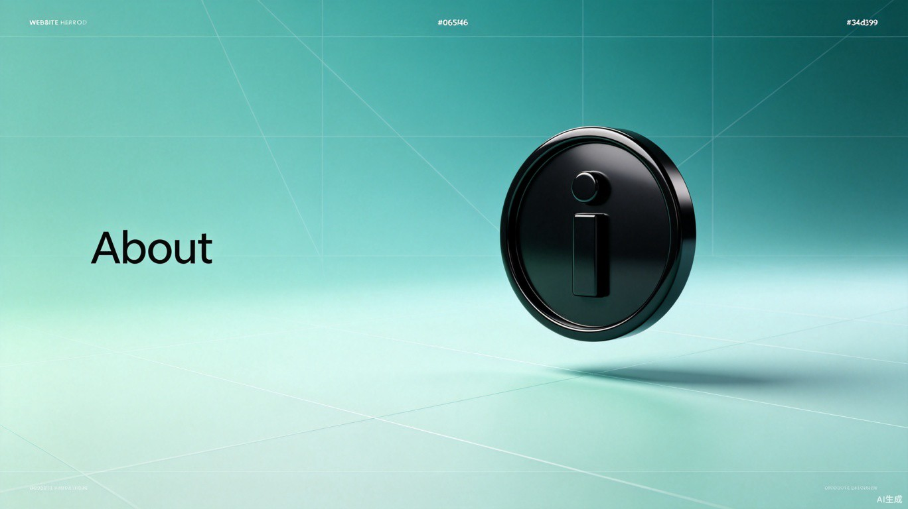
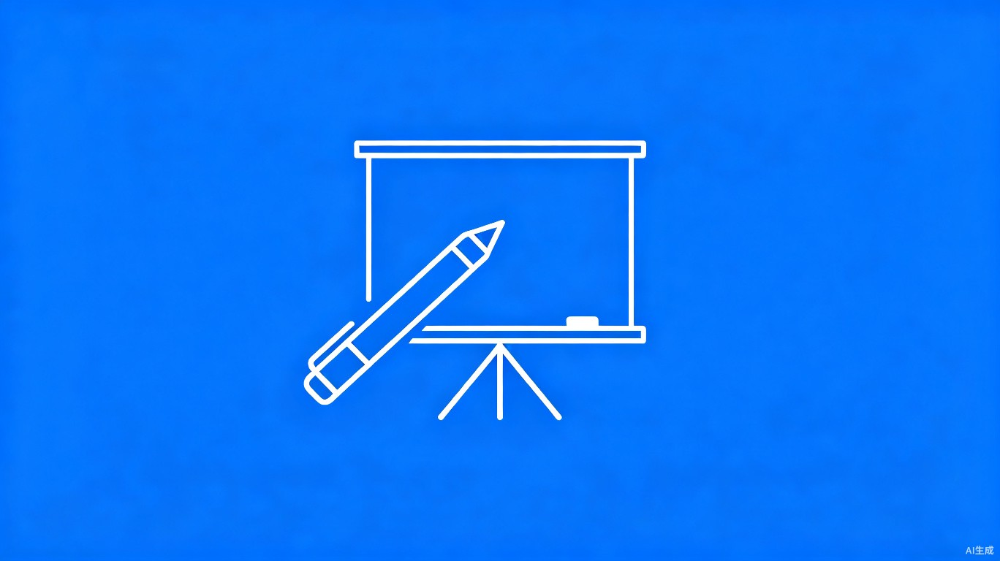
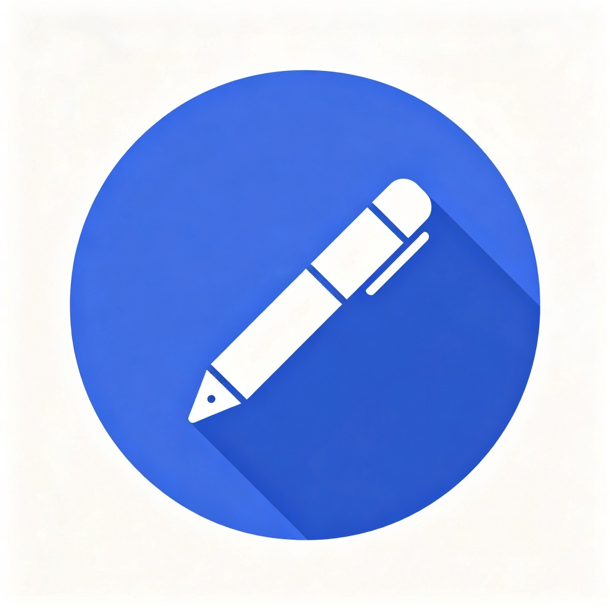
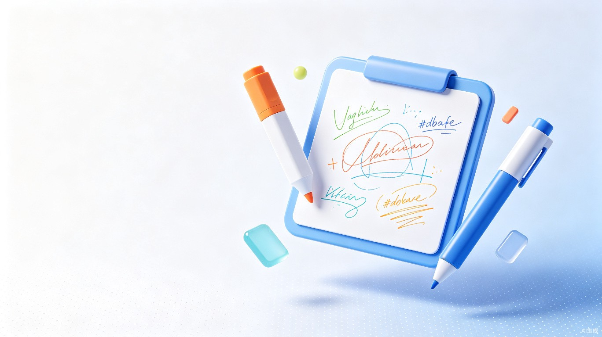
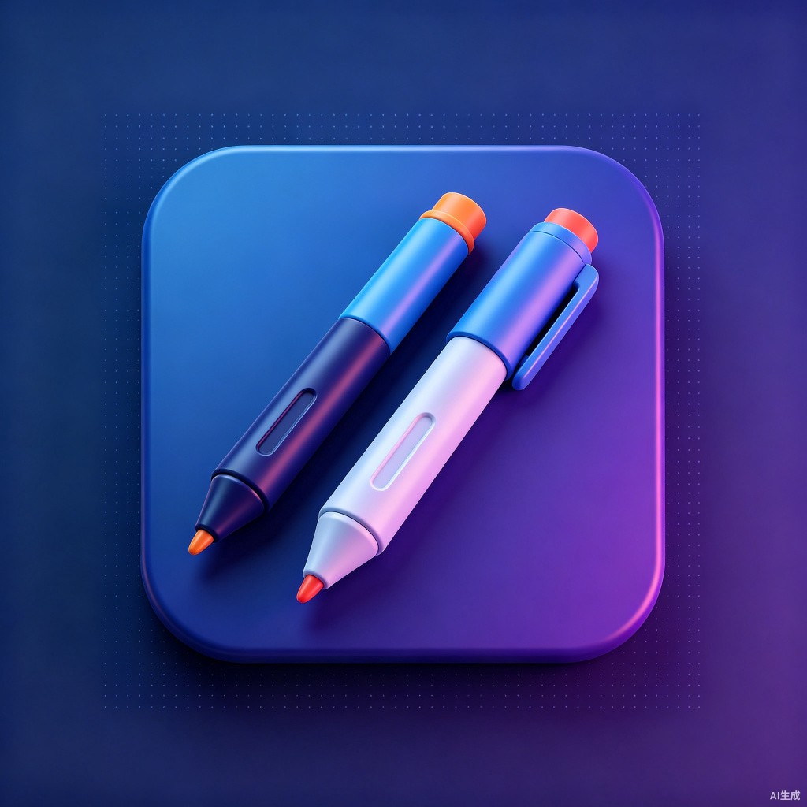

<div align="center">

# Awesome IWB

专为广大中小学电教打造的班级希沃/鸿合等一体机/数字白板/班班通一站式软件推荐清单

**为广大电教倾情撰写，让班级大屏更好用！**

[](https://github.com/sindresorhus/awesome)
[](https://creativecommons.org/licenses/by-nc-sa/4.0)
[]()
[]()

</div>

---

## 设计图展示

> 以下为项目板块导航横图，提供暗色3D、Fluent亚克力、扁平极简三种风格，以及横版和方形两种尺寸。

### 暗色 3D 风格（横版 16:9）

<table><tr>
<td align="center"><br><b>屏幕批注与白板软件</b></td>
<td align="center"><br><b>课表与看板类软件</b></td>
</tr><tr>
<td align="center"><br><b>辅助类软件与实用工具</b></td>
<td align="center"><br><b>关于 AIWB</b></td>
</tr></table>

### Fluent 亚克力风格（横版 16:9）

<table><tr>
<td align="center"><br><b>白板软件</b></td>
<td align="center"><br><b>课表看板</b></td>
</tr><tr>
<td align="center"><br><b>实用工具</b></td>
<td align="center"><br><b>主视觉横图</b></td>
</tr></table>

### 扁平极简风格（横版 16:9）

<table><tr>
<td align="center"><br><b>白板软件</b></td>
<td align="center"><br><b>课表看板</b></td>
</tr><tr>
<td align="center"><br><b>实用工具</b></td>
<td align="center"><br><b>方形缩略图</b></td>
</tr></table>

### 亮色主题（横版 16:9）与方形版本（1:1）

<table><tr>
<td align="center"><br><b>亮色 - 白板</b></td>
<td align="center"><br><b>方形 - 白板</b></td>
</tr></table>

> 完整主题展示请查看 [docs/themes.html](docs/themes.html)

---

## 快速导航

<table><tr>
<td align="center"><a href="docs/categories/whiteboard.md">✏️<br><b>屏幕批注与白板软件</b><br><sub>Screen Notation & Whiteboard Softwares</sub><br>11 个项目</a></td>
<td align="center"><a href="docs/categories/timetable.md">📊<br><b>课表与看板类软件</b><br><sub>Timetable & Dashboard Softwares</sub><br>11 个项目</a></td>
<td align="center"><a href="docs/categories/utilities.md">🛠️<br><b>辅助类软件与实用工具</b><br><sub>Utilities & Practical Tools</sub><br>33 个项目</a></td>
</tr></table>

## 贡献指南

欢迎为 Awesome IWB 添加新项目！请阅读 [完整贡献指南](docs/meta/contributing.md)。

### 快速添加项目

1. Fork 仓库，编辑 `data/projects.json` 添加项目条目
2. 运行 `node scripts/build.js` 重新生成文档
3. 提交 Pull Request

### 添加新分类

在 `categories` 数组中添加新条目，更新项目的 `category` 字段，重新构建即可。

---

## 最新收录项目

| 标记 | 项目 | 开发者 |
|------|------|--------|
| 🔴 | [InkCanvasForClass](docs/projects/inkcanvasforclass.md) | [segf4ultk1nger](https://github.com/segf4ultk1nger-universe/InkCanvasForClass) |
| 🔴 | [ICC-Re](docs/projects/icc-re.md) | [LiuYan-xwx](https://github.com/LiuYan-xwx/InkCanvasForClass-Remastered) |
| 🔴 | [LanStartWrite](docs/projects/lanstartwrite.md) | [wwiinnddyy](https://github.com/wwiinnddyy/LanStartWrite) |
| 🔴 | [SmartBoardTools](docs/projects/smartboardtools.md) | [FeedWhisper5148](https://github.com/FeedWhisper5148/SmartBoardTools_OpenSourced) |
| 🔴 | [SeewoSplash](docs/projects/seewosplash.md) | [fengyec2](https://github.com/fengyec2/custom-seewo-splash-screen) |
| 🔴 | [Class-Website](docs/projects/class-website.md) | [jiugulixiaoniu](https://github.com/jiugulixiaoniu/CWBS-ClassWebsite) |
| 🔴 | [Class-Scoring-Program](docs/projects/class-scoring-program.md) | [andycey](https://github.com/andycey/Class-Scoring-Program) |
| 🔴 | [沉浸式时钟](docs/projects/immersive-clock.md) | [QQHKX](https://github.com/QQHKX/Immersive-clock) |
| 🔴 | [沉浸式噪音监测](docs/projects/immersive-noise-monitor.md) | [QQHKX](https://github.com/QQHKX/Immersive-clock-monitor) |
| 🔴 | [360 拖堂卫士](docs/projects/360-class-guard.md) | [BSOD-MEMZ](https://github.com/BSOD-MEMZ/360-Class-Guard) |

> 查看全部项目请访问 [文档首页](docs/index.md)

---

## 项目结构

```
awesome-iwb/
├── index.html             ← Fluent Design 板块导航页
├── README.md              ← 你在这里
├── data/projects.json     ← 标准化数据源
├── assets/                ← 设计图资源
│   ├── banner-*.png       ← 暗色3D横图
│   ├── styles/fluent/     ← Fluent亚克力风格
│   ├── styles/flat/       ← 扁平极简风格
│   ├── styles/hero/       ← 超宽主视觉
│   ├── styles/thumb/      ← 方形缩略图
│   └── themes/            ← 亮色/方形主题
├── design/                ← SVG设计文件（可导入Figma）
├── docs/
│   ├── categories/        ← 分类页
│   ├── projects/          ← 项目详情页
│   └── meta/              ← 设计思路 + 贡献指南
└── scripts/build.js       ← 零依赖构建脚本
```

## 验收状态

| # | 验收项 | 状态 |
|---|--------|------|
| 1 | 单文件 → 多 MD 文件 | ✅ |
| 2 | 数据采用 JSON 格式，可复制 | ✅ |
| 3 | 标签/分类动态生成，无硬编码 | ✅ |
| 4 | 显示作者、组织、贡献者 | ✅ |
| 5 | 收录项目数 ≥ 36 | ✅ (54个) |
| 6 | 提供设计思路文档 | ✅ |
| 7 | Fluent Design HTML 展示页 | ✅ |
| 8 | 多风格多尺寸设计图 | ✅ |

## 链接

- [文档首页](docs/index.md)
- [Fluent 展示页](index.html)
- [主题展示](docs/themes.html)
- [设计思路](docs/meta/design-philosophy.md)
- [贡献指南](docs/meta/contributing.md)
- [GitHub 仓库](https://github.com/MistAperio/awesome-iwb)
- [官方网站](https://aiwb.smart-teach.cn)
